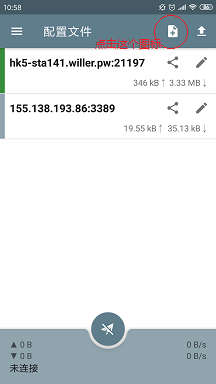
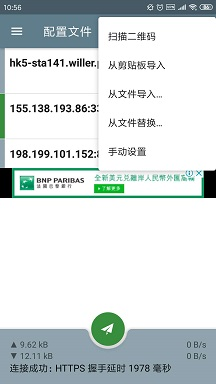
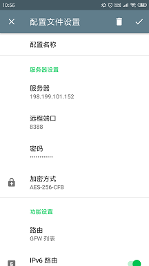
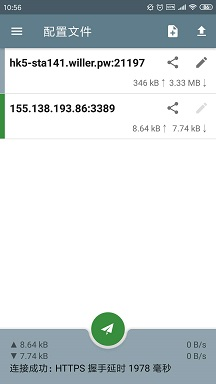
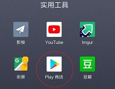

### 一、 翻墙
1. 下载 shadowsocks安装包，安装shadowsocks。    
   下载地址： https://github.com/shadowsocks/shadowsocks-android/releases 

2. 打开shadowsocks，点击右上角“+”图标，选择手动设置。（根据版本不同，界面可能略有差异）

* 服务器： 155.138.193.86
* 远程端口：3389
* 本地端口：1080
* 密码： liang3389
* 加密方法： 选择 AES-256-CFB
* 功能设置：路由：‘GFW列表’或‘绕过局域网及中国大陆地址’
* 最后，点击右上角“√”图标完成设置。

3. 点击页面中刚设置好的那一条，然后点击下方飞机按钮，当其变为绿色，表示已经翻墙成功。

### 二、 安装谷歌服务框架

* 由于YouTube等应用需要在Google Play应用商店下载，并需要谷歌服务框架支持，所以需要先安装谷歌服务框架。

1. 在应用商店（豌豆荚、应用宝或者其它你手机自带的应用商店）搜索Go谷歌安装器，下载安装。
   参考链接： https://www.wandoujia.com/apps/com.goplaycn.googleinstall

2. 打开Go谷歌安装器App，点击按钮“GO”，应用会自动安装Google的一些服务。等待全部安装后退出该App即可。

### 三、注册Google账号

1.  打开Google Play应用商店时应该会要求登录google账号，因此需要注册一个Google账号，   
    注册地址： https://accounts.google.com/SignUp?hl=zh-CN    
    (ps:此注册地址需要在翻墙后才能打开。)

2. 注册成功后，就可以使用这个账号登录Google Play应用商店，搜索YouTuBe,下载即可。

